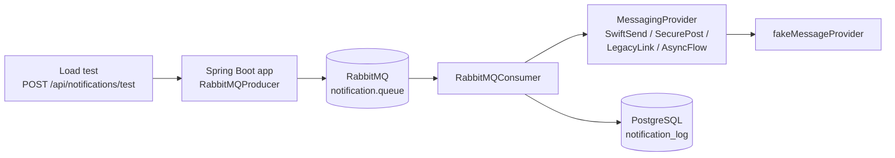

# Performance rapport — OpenMRS Communicatiemodule

**Project:** ATx2.4 Softwarearchitectuur & Kwaliteit
**Onderwerp:** Doorvoer-, schaalbaarheids- en betrouwbaarheidsanalyse van de notificatie-pipeline
**Datum:** 26 juni 2026
**System under test (SUT):** Spring Boot communicatiemodule (branch `performance-test`)
**Leeruitkomst:** LU1 — de testresultaten zijn gekoppeld aan de FMEA (zie §5).

---

## 1. Managementsamenvatting

De notificatie-pipeline is belast om te bepalen hoeveel afspraaknotificaties de module
per seconde kan verwerken en waar de doorvoer vastloopt. De test legde een duidelijke
keten van knelpunten bloot:

1. **De HTTP-laag (producer) is snel** — de module accepteert ruim **200 berichten/seconde**
   in de wachtrij.
2. **De consumer-kant was de bottleneck.** In de uitgangssituatie verwerkte de module
   slechts **~0,4 berichten/seconde**, omdat de RabbitMQ-listener op één consumer-thread
   draaide (standaardinstelling). Bij belasting liep de wachtrij op tot **~21.000 berichten**,
   waarna RabbitMQ de producers blokkeerde (backpressure) en de HTTP-latency explodeerde
   (gemiddeld 2,3 s, uitschieter ~898 s).
3. **Na het instellen van consumer-concurrency** (8–16 parallelle consumers) steeg de doorvoer
   naar **~3,0 berichten/seconde gemiddeld met pieken tot ~20/s** — een verbetering van
   **factor ~7,5** gemiddeld en **~25** in piek.
4. **De fix legde een tweede knelpunt bloot:** de uitgaande provider-aanroepen lopen op de
   standaard Reactor Netty connection-pool, die onder parallelle belasting verzadigt en de
   doorvoer in golven van ~45 seconden afknijpt.

5. **Een end-to-end test via de OpenMRS-ingest** (polling → FHIR-validatie → verzenden) toonde
   aan dat de **ingest-laag snel is** (~47 berichten/seconde, inclusief de zware FHIR-validatie),
   en bevestigde dat de verzend-/provider-kant de bottleneck is.
6. **Onder load treedt provider-rate-limiting op** (HTTP 429). De module degradeert dan precies
   zoals in de FMEA voorzien: 5× retry met exponential backoff → dead-letter queue. Dit
   **valideert de FMEA-maatregelen voor risico's #3, #4 en #6 onder realistische belasting** (§5).

**Belangrijkste aanbeveling:** stel de consumer-concurrency in (gemeten effect: ~7,5× hogere
doorvoer) en optimaliseer de WebClient connection-pool van de providers. Overweeg daarnaast om
de `Retry-After`-header van een 429-respons te respecteren, zodat de module zich aan de
provider-rate-limit aanpast in plaats van werk naar de dead-letter queue te laten weglekken.

---

## 2. Doel en scope

### Doel
Vaststellen wat de maximale doorvoer van de end-to-end notificatie-pipeline is, of de
architectuur meerdere tenants en providers gelijktijdig aankan, en waar de doorvoer
vastloopt onder belasting.

### Scope — de geteste pipeline



Elke request publiceert één bericht naar RabbitMQ. De consumer haalt het bericht op,
verstuurt het via de gekozen provider en schrijft het resultaat (success/failed) naar de
database en de metric `notifications_sent_total`.

Er zijn twee invalshoeken gemeten:
- **Verzend-helft** (§4.1–4.5): de pipeline gevoed via `POST /api/notifications/test` — meet
  producer-throughput en consumer-doorvoer.
- **Hele pipeline** (§4.6): gevoed via de **OpenMRS-ingest** met de fake-OpenMRS, zodat ook de
  `PollingJob`, FHIR-mapping en FHIR-validatie onder load worden getest.

### Buiten scope
- De `NotificationScheduler` (24u/1u timing) — niet relevant voor doorvoermeting.
- Externe netwerklatency naar echte providers — er is een lokale fake-provider gebruikt die
  rate-limiting (429) en willekeurige fouten simuleert.

---

## 3. Testopzet

### Omgeving
Alle componenten draaiden lokaal via `docker-compose` op één machine (Windows 11, Java 21
in de container). De app communiceert over HTTPS (TLS 1.3) op poort 8443.

### Gereedschap
| Instrument | Functie |
|---|---|
| `performance/loadtest.py` | HTTP load test — meet throughput en latency-percentielen van de producer-laag |
| `performance/measure_drain.py` | Meet de consumer-doorvoer (msg/s die de provider daadwerkelijk verstuurt) |
| `performance/pipeline_e2e_measure.py` | Meet de **hele pipeline** via de OpenMRS-ingest (polling → FHIR → verzenden) |
| `performance/pipeline-loadtest.jmx` | Gelijkwaardig JMeter-testplan |
| RabbitMQ Management API | Wachtrij-diepte (ready/unacked) en aantal consumers |
| Prometheus / Grafana | `notifications_sent_total`, queue-diepte over tijd |

> **Meetkeuze.** De HTTP-throughput meet alleen tot "in queue". De échte pipeline-doorvoer
> is de snelheid waarmee de consumer de wachtrij leegtrekt. Die is gemeten als delta van
> `notifications_sent_total` over de tijd, terwijl er een backlog in de wachtrij stond — los
> van eventuele HTTP-backpressure.

### Belastingsmodel — meerdere tenants en providers
De test verdeelt het verkeer over **4 tenants × 4 providers = 16 combinaties**
(zie `performance/tenants-providers.csv`):

| Tenants | Providers |
|---|---|
| test-ziekenhuis, amsterdam-umc, radboud-umc, erasmus-mc | SWIFTSEND, SECUREPOST, LEGACYLINK, ASYNCFLOW |

Daarmee wordt zowel de multi-tenant- als de multi-provider-werking onder gelijktijdige
belasting getest.

---

## 4. Resultaten

### 4.1 Producer-laag (HTTP load test)

Test: 50 gelijktijdige workers tegen `POST /api/notifications/test`.

| Metric | Waarde |
|---|---|
| Geaccepteerd (HTTP 202) | 20.202 berichten |
| Error % | 0,01 % |
| HTTP-throughput (korte burst, lege wachtrij) | ~178 req/s |
| Wachtrij-diepte op piek | **~20.955 berichten** |
| HTTP-latency gemiddeld | 2.305 ms |
| HTTP-latency p99 | 538 ms |
| HTTP-latency max | **897.952 ms (~15 min)** |

**Observatie.** De producer is snel, maar omdat de consumer het tempo niet bijhoudt, loopt
de wachtrij vol. RabbitMQ bereikt zijn memory-watermark en activeert flow-control: de
publishers worden geblokkeerd, waardoor individuele HTTP-aanroepen seconden tot minuten
blijven hangen en de throughput instort van ~178 naar ~21 req/s. Het grote verschil tussen
de p99 (538 ms) en de max (~898 s) toont dat de meeste requests snel zijn, maar een deel
volledig vastloopt op de backpressure.

### 4.2 Consumer-doorvoer — baseline (1 consumer)

Test: backlog opgebouwd, drain rate gemeten over ~112 s.

| Metric | Waarde |
|---|---|
| Actieve consumers | **1** |
| Prefetch (default) | 250 (komt overeen met "Messages Unacked: 250" in Grafana) |
| Gemiddelde drain rate | **0,4 msg/s** |
| Piek drain rate | 0,8 msg/s |
| Verwerkingstijd per bericht | ~2,4 s |

**Root cause.** Er was nergens listener-concurrency of prefetch geconfigureerd, dus de
`@RabbitListener` draaide op Spring's standaard van **één consumer-thread**. Berichten worden
strikt serieel verwerkt. Omdat het werk per bericht I/O-bound is (provider-HTTP-aanroep +
DB-write), staat die ene thread vrijwel continu te wachten.

### 4.3 Interventie — consumer-concurrency

Toegevoegd aan `src/main/resources/application.properties`:

```properties
spring.rabbitmq.listener.simple.concurrency=8
spring.rabbitmq.listener.simple.max-concurrency=16
spring.rabbitmq.listener.simple.prefetch=10
```

Onderbouwing: het werk is I/O-bound, dus meerdere consumers parallelliseren de wachttijd op
provider-aanroepen. Een lage prefetch verdeelt berichten eerlijk over de consumers in plaats
van dat enkele consumers de hele wachtrij claimen.

### 4.4 Consumer-doorvoer — na de fix (8–16 consumers)

| Metric | Baseline | Na fix | Verbetering |
|---|---|---|---|
| Actieve consumers | 1 | 8–10 | — |
| Gemiddelde drain rate | 0,4 msg/s | **3,0 msg/s** | **~7,5×** |
| Piek drain rate | 0,8 msg/s | **20,3 msg/s** | **~25×** |
| Backlog ~230 leeglopen | ~10 min | **~6 s** | **~100×** |

Een backlog die in de baseline ~10 minuten kostte, was na de fix in ongeveer 6 seconden
verwerkt.

### 4.5 Tweede bottleneck — provider connection-pool

De na-meting verliep **schokkerig**: perioden van ~40 s zonder voortgang, gevolgd door een
burst van ~20 msg/s, cyclisch met een periode van **~40–45 seconden** (bursts rond
t+41, t+82, t+127, t+168 en t+214 s).

**Root cause.** De provider-clients bouwen hun WebClient uit Spring's auto-configured
`WebClient.Builder` (zie `src/main/java/.../provider/swiftsend/SwiftSendClient.java`) en
gebruiken **niet** de in `WebClientConfig` geconfigureerde `webClient()`-bean. Daardoor
draaien de uitgaande aanroepen op de **standaard Reactor Netty connection-pool**. Onder 16
parallelle consumers verzadigt die pool; overige aanroepen wachten in de pending-acquire-queue
en worden in golven vrijgegeven. De waargenomen periode van ~45 s komt overeen met de
standaard `pendingAcquireTimeout` van Reactor Netty.

De bottleneck is dus verschoven: van **"één consumer-thread"** (opgelost) naar
**"de provider-connection-pool"**. De gemeten piek van ~20 msg/s laat zien dat de consumers
de doorvoer aankunnen; de uitgaande HTTP-laag knijpt de sustained doorvoer af.

---

### 4.6 Hele pipeline — end-to-end via de OpenMRS-ingest

Test: de fake-OpenMRS geeft 150 afspraken terug (allemaal binnen het 1u-verzendvenster); de
`PollingJob` haalt ze op en duwt ze door de volledige keten. Gemeten met
`pipeline_e2e_measure.py`.

| Metric | Waarde |
|---|---|
| Ingest-latency (poll → eerste bericht in queue) | **~3 s** |
| Ingest-doorvoer (poll + FHIR-mapping + validatie + publiceren) | **~47 msg/s** |
| Piek queue-diepte | **~291** |
| Verzend-rate | laag, met bursts |

**Observatie 1 — ingest is snel.** Binnen ~3 s na de poll stonden ~143 afspraken in de queue,
volledig FHIR-gemapt en gevalideerd. De zware FHIR-validatie (HAPI FHIR R4) vormt onder deze
load geen knelpunt; de ingest loopt juist ver vooruit op het verzenden (piek queue ~291).

**Observatie 2 — de provider rate-limit onder load (belangrijk).** Bij hoog volume gaf de
provider **HTTP 429 (Too Many Requests)** terug (`"Rate limit exceeded. Check headers."`).
Gevolg: de berichten faalden, werden 5× herprobeerd via de retry-queues (zichtbaar in Grafana:
retry-queues gevuld met 37 / 139 / 102) en belandden daarna in de **dead-letter queue**.

| Bron | Cijfer |
|---|---|
| Succesvol afgeleverd (alle runs, `notification_logs`) | **2.252** |
| Mislukte pogingen (incl. retries) | 15.860 |
| Faalvrij gebleven provider | **LEGACYLINK (0 fouten)** |
| Sterk rate-limited providers | SECUREPOST, ASYNCFLOW, SWIFTSEND |

**Conclusie van de e2e-test.** Onder load is niet de app maar de **provider-rate-limit** de
beperkende factor. De module degradeert gecontroleerd via retry → dead-letter (zoals ontworpen),
maar past zich niet aan de rate-limit aan — overtollig werk lekt naar de dead-letter queue. Dit
is precies de koppeling met de FMEA (§5).

---

## 5. Koppeling met de FMEA (LU1)

Een performance test is voor LU1 pas compleet als de resultaten aantonen dat de **failure modes
uit de FMEA** onder realistische belasting optreden én dat de bijbehorende **maatregelen werken**.
De load- en e2e-tests triggeren meerdere FMEA-risico's en valideren de maatregelen:

| FMEA # | Failure mode | Maatregel (FMEA) | Aangetoond door de test |
|---|---|---|---|
| **#4** | Provider geeft `429 Too Many Requests` (rate-limit) | RabbitMQ 5× retry met exponential backoff (5s/30s/2m/5m/10m) → dead-letter | ✅ **Direct waargenomen** in de e2e-run: 429 in de logs → retry-queues gevuld (37/139/102) → dead-letter queue liep op. De maatregel werkt exact zoals beschreven. |
| **#3** | Provider tijdelijk onbereikbaar | Idem (retry → dead-letter) | ✅ Zelfde retry/dead-letter-mechanisme zichtbaar onder load. |
| **#6** | Provider geeft willekeurige error (500) | Idem (retry → dead-letter) | ✅ Mislukte deliveries doorlopen dezelfde retry-keten. |
| **#5** | Dubbele delivery van een bericht | Idempotency-key op notificatie-/event-id | ✅ Bevestigd: bij herhaalde polling worden reeds verwerkte afspraken overgeslagen (`processed_events`); een nieuwe meting vereist het legen van die tabel. |
| **#1/#2** | OpenMRS API onbereikbaar / geen data | Fout loggen, cyclus overslaan, 5 min later opnieuw | ◻ Niet apart belast; wel afgedekt door de polling-architectuur (testbaar door fake-OpenMRS te stoppen). |

**Kernboodschap voor het CGI.** De performance test belast de hele pipeline; onder die load
treedt FMEA-risico **#4 (provider-ratelimit, 429)** daadwerkelijk op, en in Grafana is te zien dat
de **FMEA-maatregel** — retry met exponential backoff gevolgd door de dead-letter queue — precies
werkt zoals vastgelegd. Zo is de test direct gekoppeld aan de risicoanalyse: de test bewijst dat
de bedachte maatregelen onder realistische belasting standhouden.

**Verbeterpunt dat de test blootlegt.** De FMEA-maatregel vangt 429 op met *vaste* backoff, maar
de provider geeft een `Retry-After`-header mee die genegeerd wordt. Een verfijning van maatregel
#4 is om die header te respecteren, zodat berichten niet onnodig naar de dead-letter queue lekken.

---

## 6. Conclusies

1. **De architectuur is functioneel correct onder belasting:** multi-tenant en multi-provider
   verkeer wordt verwerkt met een verwaarloosbaar foutpercentage (0,01 %).
2. **De grootste schaalbaarheidswinst zit in consumer-concurrency.** Eén configuratie-wijziging
   gaf een doorvoerverbetering van factor ~7,5 gemiddeld.
3. **Zonder backpressure-bescherming is de producer een risico:** de module accepteert
   onbeperkt berichten, waardoor de wachtrij en het geheugen van RabbitMQ vollopen en
   publishers vastlopen.
4. **De uitgaande provider-laag is het volgende knelpunt.** De geconfigureerde WebClient-bean
   wordt niet gebruikt, waardoor de standaard connection-pool de sustained doorvoer beperkt.

---

## 7. Aanbevelingen (geprioriteerd)

| # | Aanbeveling | Verwacht effect | Status |
|---|---|---|---|
| 1 | Consumer-concurrency instellen (`concurrency=8`, `max-concurrency=16`, `prefetch=10`) | ~7,5× hogere doorvoer | Effect gemeten |
| 2 | Provider-clients de geconfigureerde connector laten gebruiken én de connection-pool vergroten (`ConnectionProvider` met o.a. hogere `maxConnections`, kortere `pendingAcquireTimeout`) | Schokkerig patroon verdwijnt; sustained doorvoer richting ~20 msg/s | Aanbevolen |
| 3 | Concurrency, prefetch en pool-grootte op elkaar afstemmen na meting #2 | Optimale balans consumer ↔ provider | Aanbevolen |
| 4 | Producer-side backpressure / rate limiting overwegen (bv. publisher confirms + begrenzing) | Voorkomt geheugendruk en publisher-blocking bij pieken | Aanbevolen |
| 5 | `Retry-After`-header van een 429-respons respecteren (verfijning FMEA-maatregel #4) | Minder berichten naar de dead-letter queue bij rate-limiting | Aanbevolen |
| 6 | Meting herhalen op productie-achtige hardware en met echte provider-latency | Realistischer capaciteitscijfer | Aanbevolen |

---

## 8. Beperkingen van het onderzoek

- Alle componenten draaiden op één lokale machine; consumer en provider concurreren om
  dezelfde CPU/IO. Op gescheiden infrastructuur kunnen de absolute cijfers hoger liggen.
- De provider is een lokale **fake** (`fakeMessageProvider`) die latency simuleert; echte
  providers hebben andere latency- en rate-limit-karakteristieken.
- De drain-metingen zijn uitgevoerd over vensters van ~110–245 s; langere runs geven stabielere
  gemiddelden.

---

## 9. Reproduceren

Vanuit de projectroot:

```bash
# 1. Stack starten
docker-compose up -d --build

# 2. (optioneel) wachtrij legen voor een schone meting
docker exec atx24-rabbitmq rabbitmqctl purge_queue notification.queue

# 3. HTTP load test (verzend-helft)
cd performance
python loadtest.py --threads 50 --duration 120

# 4. Consumer-doorvoer meten (voor/na een wijziging)
python measure_drain.py --backlog 3000 --label "baseline"

# 5. Hele pipeline via de OpenMRS-ingest (zie README.md voor het volledige recept)
#    crank fake-openmrs, leeg processed_events + queue, herstart app, dan:
python pipeline_e2e_measure.py --expected 150 --max-wait 300
```

Zie [README.md](README.md) voor alle parameters en de JMeter-variant.

### Ruwe meetdata

| Run | Bestand / bron |
|---|---|
| HTTP load test | `loadtest.py` console-output (sectie 4.1) |
| Drain baseline | `measure_drain.py --label "baseline (concurrency=1)"` (sectie 4.2) |
| Drain na fix | `measure_drain.py --label "na fix (concurrency=8-16)"` (sectie 4.4) |
| Hele pipeline (e2e) | `pipeline_e2e_measure.py --expected 150` (sectie 4.6) |
| Wachtrij, retry & dead-letter | RabbitMQ Management API + Grafana-dashboard (Queue Status / Queued Messages) |
| Totalen per provider/status | `notification_logs` (DB) + Prometheus `notifications_sent_total{provider,status}` |
| Rate-limit-bewijs (429) | App-logs: `SecurePost API Error: 429 TOO_MANY_REQUESTS` |
